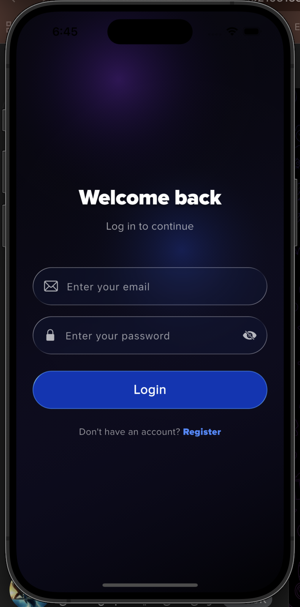
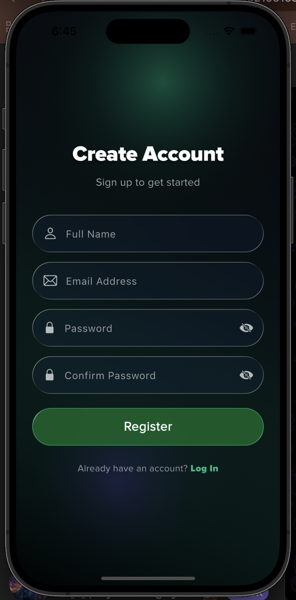
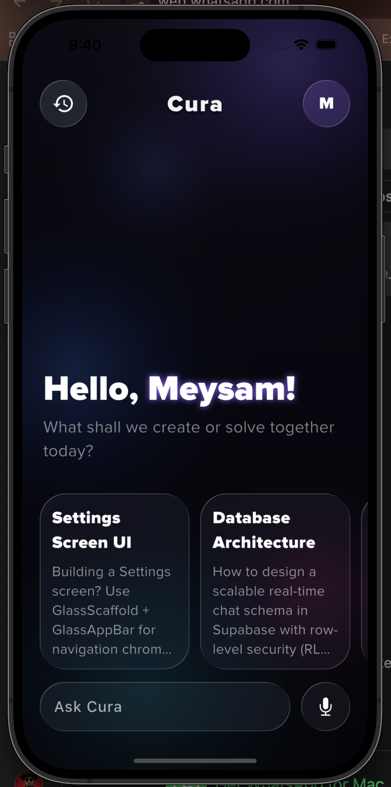

# Cura

دستیار هوشمند با رابط تیره و شیشه‌ای، برای گفتگو، مرور تاریخچه و فضای آرامش. Cura روی Flutter ساخته شده و احراز هویت، پروفایل و تاریخچه مکالمه را با Supabase نگه می‌دارد.

<table align="center">
  <tr>
    <td align="center">
      
    </td>
    <td align="center">
      
    </td>
    <td align="center">
      
    </td>
  </tr>
  <tr>
    <td align="center"><b>ورود</b></td>
    <td align="center"><b>ثبت‌نام</b></td>
    <td align="center"><b>خانه</b></td>
  </tr>
</table>

## امکانات

- ورود و ثبت‌نام با ایمیل و رمز عبور، همراه با اعتبارسنجی فرم
- اسپلش‌اسکرین با بررسی نشست فعال و هدایت خودکار
- صفحه گفتگو با پیشنهادهای آماده، ویدیوی خوش‌آمد و ارسال پیام به دستیار
- پاسخ‌های مارک‌داون، نمایش وضعیت انتظار و ادامه همان گفتگو
- تاریخچه مکالمه‌ها با حذف گفتگو و بازگشت به همان نشست
- قطب‌نما برای فضای سلامت روان: موسیقی، مدیتیشن، تمرین و ژورنال
- نوار پایین شیشه‌ای با بازخورد لرزشی هنگام تعویض تب
- پوسته تیره، فونت Proxima Nova و گرادیان اختصاصی هر صفحه

## پشته فنی

| لایه | انتخاب |
| --- | --- |
| فریم‌ورک | Flutter، Material 3 |
| احراز هویت و داده | Supabase |
| گفتگو | HTTP روی نقطه پایانی `/send-message` |
| رابط شیشه‌ای | `packages/liquid_glass_widgets` |
| محتوای پاسخ | `flutter_markdown` |
| ویدیو و بازخورد | `video_player`، `vibration` |

رابط شیشه‌ای داخل `packages/liquid_glass_widgets` کنار پروژه نگه داشته شده است. صفحه‌ها به همین بازبینی محلی وابسته‌اند و نسخه منتشرشده روی pub.dev همان پارامترها را ندارد.

## معماری

منطق قابل‌تست از ویجت‌ها جدا شده است:

- `lib/core` تنظیمات، تم، اعتبارسنجی و قالب‌بندی را نگه می‌دارد.
- `lib/models` شکل پاسخ دستیار و خلاصه نشست را تعریف می‌کند.
- `lib/services` فقط با Supabase و API حرف می‌زند. `ChatbotService` کلاینت HTTP و خواندن توکن را از بیرون می‌پذیرد تا بدون شبکه تست شود.
- `lib/screen` صفحه‌ها را می‌سازد و `lib/navigation` پوسته تب‌ها را نگه می‌دارد.

بعد از ورود یا ثبت‌نام موفق، مسیر قبلی پاک می‌شود و کاربر به پوسته اصلی با تب گفتگو می‌رسد. اگر نشست از قبل معتبر باشد، اسپلش همان مسیر را باز می‌کند.

## ساختار

```text
lib/
  core/          تنظیمات، تم، اعتبارسنجی، قالب‌بندی
  models/        مدل‌های خالص
  services/      دستیار و تاریخچه
  api/           آدرس و مسیرهای HTTP
  navigation/    نوار پایین
  screen/        اسپلش، احراز هویت، خانه، گفتگو، تاریخچه، قطب‌نما
  widget/        پس‌زمینه مشترک
packages/liquid_glass_widgets
test/            تست واحد و ویجت
docs/screenshots تصاویر ردمی
```

## پیش‌نیاز

- Flutter سازگار با Dart `3.11`
- Xcode برای iOS و Android Studio برای اندروید
- یک پروژه Supabase با جدول‌های `profiles`، `session_histpry` و `messages_history`
- سرویس گفتگو که `POST /send-message` را با هدر `Authorization: Bearer <access_token>` بپذیرد

نام جدول `session_histpry` همان نام فعلی بک‌اند است.

### Supabase

جدول `profiles`:

| ستون | نقش |
| --- | --- |
| `user_id` | شناسه کاربر احراز هویت |
| `fullname` | نام نمایشی |

جدول `session_histpry`:

| ستون | نقش |
| --- | --- |
| `id` | شناسه نشست |
| `user_id` | مالک نشست |
| `title` | عنوان گفتگو |

جدول `messages_history`:

| ستون | نقش |
| --- | --- |
| `session_id` | نشست والد |
| `user_message` | پیام کاربر |
| `bot_message` | پاسخ دستیار |
| `created_at` | زمان ثبت |

بدنه درخواست گفتگو:

```json
{
  "user_message": "متن پیام",
  "session_id": "فقط از پیام دوم به بعد"
}
```

پاسخ موفق این فیلدها را دارد: `message`، `user_id`، `email`، `session_id`، `title`.

## اجرا

```bash
flutter pub get
flutter run
```

مقادیر پیش‌فرض در `lib/core/config/app_config.dart` قرار دارند. برای محیط خودتان همان‌ها را با `--dart-define` عوض کنید:

```bash
flutter run \
  --dart-define=SUPABASE_URL=https://your-project.supabase.co \
  --dart-define=SUPABASE_PUBLISHABLE_KEY=your_publishable_key \
  --dart-define=API_BASE_URL=https://your-api.example
```

کلید قابل‌انتشار Supabase برای کلاینت است و با سیاست سطح ردیف محافظت می‌شود. کلید سرویس، فایل `key.properties` و keystore را وارد مخزن نکنید.

## تست

```bash
flutter test
flutter analyze
```

تست‌ها این‌ها را پوشش می‌دهند:

- اعتبارسنجی ورود و ثبت‌نام
- نام نمایشی و حرف اول پروفایل
- زمان‌بندی تاریخچه، عنوان، پیش‌نمایش و ترتیب نشست‌ها
- تجزیه پاسخ دستیار و قرارداد درخواست HTTP، بدون شبکه واقعی
- رندر گرادیان خانه و صفحه Oracle

## مسیر محصول

| مسیر | کار |
| --- | --- |
| اسپلش | بررسی نشست |
| ورود / ثبت‌نام | ساخت حساب و پروفایل |
| گفتگو | خانه دستیار |
| تاریخچه | فهرست، ادامه و حذف |
| قطب‌نما | فضای سلامت روان |
| Oracle | جای خالی برای راهنمایی عمیق‌تر |

## مجوز فونت

فونت‌های Proxima Nova در `assets/fonts` هستند. پیش از انتشار عمومی، مجوز استفاده از این فونت را بررسی کنید.
